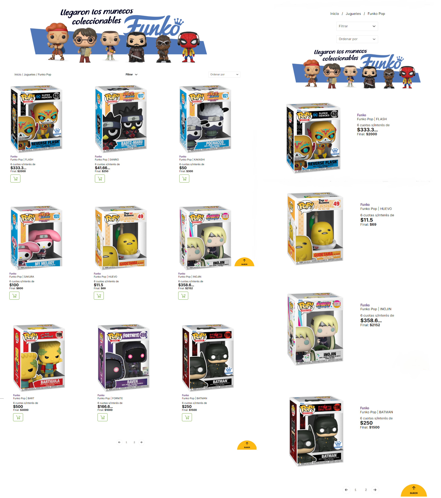

<h1 align="center"> Bienvenido a mi repositorio! </h1>  
 

🌱Hola, soy Franco Mammoli tengo 23 años resido en Mendoza-Argentina, soy programador web FullStack como desarrollador utilizo Javascript, React, NodeJS, Express, Sequalize, entre otros. Mi pasatiempo es el desarrollo de videos juegos!

 
Me gusta aprender y afrontar desafíos que me permitan mejorar profesionalmente. 
 
 

# 💡 Algunos Proyectos:
## :small_blue_diamond: Pagina web Funko Pops:
 Un catálogo de productos donde el usuario pueda agregar, editar (precio, stock, descuento, cuotas), eliminar y visualizar los productos consumidos desde una api propia.

 

**WEB &nbsp; | &nbsp; RESPONSIVE**

 

 

## :small_blue_diamond: Pagina web realizada para un restaurante:
  :computer: En la web podemos: 
- Registrarnos/ logearnos
- Editar, Modificar, Eliminar producto del menu (CRUD)  
  
  🛠️ Tecnologias usadas:  
   
  
- Node.js
- Express
- Ejs
- MySQL
- Sequelize

 
 

> ## ¿Hablamos? 
- <a href="https://www.linkedin.com/in/franco-mammoli-0a4455142/" target="blank">LinkedIn</a>
- <a href="francomammoli@hotmail.com" target="blank">francomammoli@hotmail.com</a>
-    
                                                                                                                 

 
